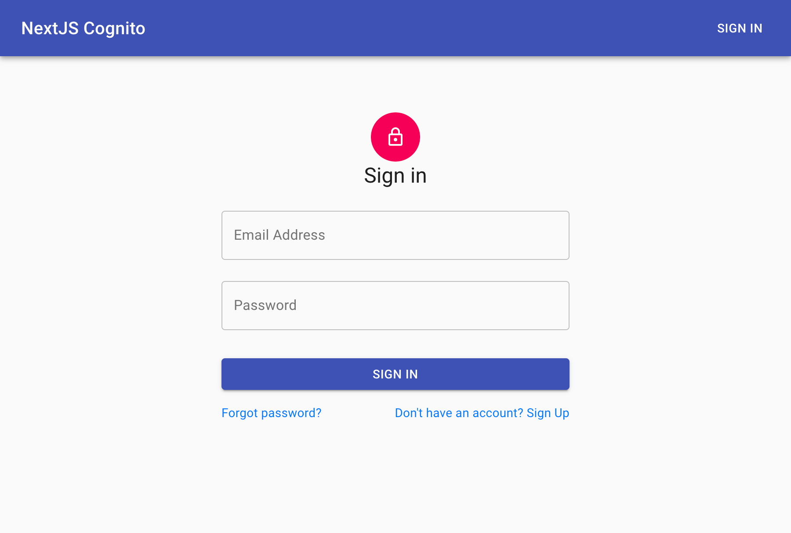

## NextJS SSR AWS Cognito JWT Authentication



This is a NextJS boilerplate with SSR compatible, httpOnly cookie based AWS Cognito authentication using Redux for state management.

### Configuration

In next.config.js
```javascript
...
    env : {
      USER_POOL_ID: 'xxxxxxxxxxxxxxxxx',
      CLIENT_ID: 'xxxxxxxxxxxxxxxxxxxxxxxx'
    },
...
```
